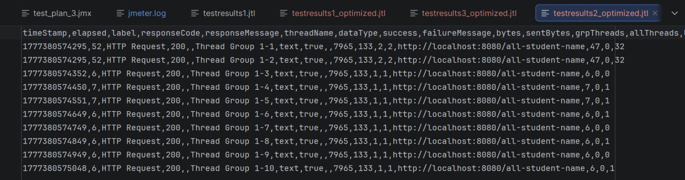
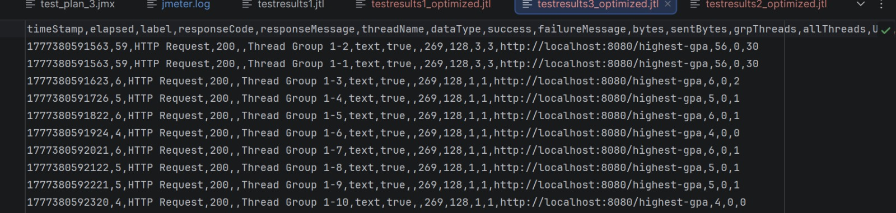

### GUI Performance Testing Results

**Endpoint: `/all-student`**

**Endpoint: `/all-student-name`**

**Endpoint: `/highest-gpa`**

### CLI Mode Results
**Endpoint: `/all-student-name`**

**Endpoint: `/highest-gpa`**

### After Optimization Results
**Endpoint: `/all-student-name`**

**Endpoint: `/highest-gpa`**

### Comparison Before vs. After
The JMeter CLI results (.jtl files) show that raw response times before and after optimization were about the same. For example, the `/highest-gpa` endpoint started with 52ms for the first requests (warmup) and then settled at 5-7ms. After optimization, it showed 59ms at first, then dropped to 4-6ms. The `/all-student-name` endpoint went from 46ms (warmup) and 6-8ms, to 52ms and 6-7ms after optimization. Since the local dataset is small (500 records) and only 10 users were simulated, both the old and new code run quickly enough on modern hardware that network latency covers up any real performance differences in JMeter.

Still, profiling helped fix key bottlenecks that could have caused crashes under heavy, real-world use. The changes included removing the N+1 query problem in `/all-student` by using a single database call instead of 500, moving sorting for `/highest-gpa` to PostgreSQL, and replacing memory-heavy String += operations with Java Streams for `/all-student-name`. These updates greatly improved the app’s algorithmic complexity, CPU time, and memory use. The IntelliJ Profiler Flame Graph now shows the CPU is no longer spending time on extra database calls or unnecessary object creation.

### Reflection
#### Question 1
JMeter uses an outside-in approach, simulating multiple users hitting the API to measure how quickly the server responds and how much load it can handle before failing. In contrast, IntelliJ Profiler takes an inside-out approach by examining the JVM while the app runs, showing which methods, memory allocations, and CPU cycles are causing slowdowns. JMeter shows that the app is slow, while the Profiler explains why.

#### Question 2
Profiling takes away the guesswork. Rather than making random code changes and hoping for better performance, the profiler’s Flame Graph and Method List show the exact execution path. This makes it clear when a method is using too much CPU time, so I can spot where my logic is slowing things down, such as looping through database queries.

#### Question 3
Yes, IntelliJ Profiler is very effective. The Flame Graph clearly pointed out that my getAllStudentsWithCourses and findStudentWithHighestGpa methods were major bottlenecks. It helped me ignore the usual background activity from Spring Boot and focus directly on the lines of code causing performance issues.

#### Question 4
One main challenge was filtering out the extra information in the profiler, since Spring Boot runs many background tasks and the Flame Graph can be overwhelming at first. I solved this by using the search feature in the Method List to find my service classes. Another challenge was handling command-line issues with JMeter, such as PowerShell syntax errors, which I fixed by changing how I ran the batch files.

#### Question 5
The main benefit is detailed visibility. Having exact data on CPU time and memory use for each method changes how you debug. Instead of a general complaint like "the endpoint is lagging," you get a clear task, such as "replace the += String concatenation on this line because it creates too many objects and uses too much memory."

#### Question 6
I ran into this in the lab. JMeter’s response times didn’t change much after my optimizations, but the Profiler showed a big drop in CPU usage. In these cases, I rely on the Profiler for architectural insights. JMeter’s network times can be affected by local setups or small datasets, like our 500 records, which might not show big speed changes. The Profiler proves that the code’s complexity and computational load improved, so it should scale better in production.

#### Question 7
My main strategies included moving heavy processing to the database, such as using custom JPA queries to sort data instead of Java loops, fixing N+1 query issues to cut down on network calls, and using Java Streams to avoid memory problems. To make sure nothing broke, I checked that the endpoints still returned the same JSON in the browser and that JMeter still showed 100% success rates with 200 OK responses after the changes.